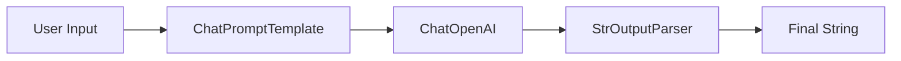

# Chapter 03 Summary

## Keywords
- **OpenAI API**: GPT 모델 인터페이스.
- **LangChain Core**: `Prompts`, `OutputParsers`.
- **LCEL (LangChain Expression Language)**: 파이프(`|`)를 이용한 선언적 체인 구성.

## Concept
LangChain의 가장 기초적인 "Hello World" 단계입니다. LLM을 호출하고, 입력을 프롬프트에 넣고, 출력을 문자열로 파싱하는 일련의 과정을 하나의 **체인(Chain)** 으로 묶습니다. LCEL은 리눅스 파이프라인처럼 데이터의 흐름을 직관적으로 표현합니다.

## Analysis
### Pros & Cons
- **Pros**:
    - **가독성**: 파이프(`|`) 문법으로 데이터 흐름이 한눈에 보임.
    - **표준화**: 모델 교체나 파서 변경이 레고 블록처럼 쉬움.
- **Cons**:
    - **디버깅**: 체인 내부에서 에러가 발생하면 추적이 까다로울 수 있음.
    - **추상화 비용**: 단순한 API 호출에 비해 초기 학습 곡선이 존재.

### Application Points
- **Simple Chatbot**: 입력을 받아 답변을 주는 기본 챗봇.
- **Translator**: 입력 텍스트를 특정 언어로 번역하여 반환하는 도구.
- **Data Extractor**: 비정형 텍스트에서 특정 정보만 뽑아내는 파이프라인.

## Structure

## Flow (Simplified)
1.  **Setup**: `.env` 로드 및 모델 초기화.
2.  **Chain**: `Prompt` | `LLM` | `OutputParser` 연결.
3.  **Run**: `invoke()`로 실행하여 결과 획득.