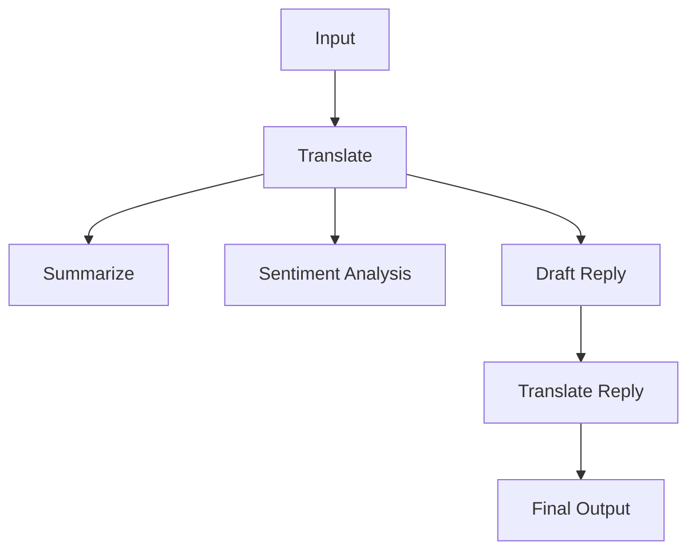

# Chapter 04 Summary

## Keywords
- **Sequential Chain**: 여러 작업을 순차적으로 실행.
- **RunnablePassthrough**: 데이터 파이프라인 중계.
- **LCEL Assign**: 체인 중간에 새로운 변수를 추가/할당.

## Concept
하나의 LLM 호출로 해결되지 않는 복잡한 작업을 **여러 단계**로 쪼개어 해결합니다. 앞 단계의 출력이 뒷 단계의 입력이 되는 구조(Chaining)입니다. "번역하고 -> 요약하고 -> 이메일 쓰기"처럼 논리적 순서가 있는 작업에 필수적입니다.

## Analysis
### Pros & Cons
- **Pros**:
    - **모듈화**: 복잡한 문제를 작은 단위로 분해하여 해결 가능.
    - **재사용성**: 각 단계(번역 체인, 요약 체인)를 다른 곳에서도 재사용 가능.
- **Cons**:
    - **Latency**: 단계가 많아질수록 전체 응답 속도가 느려짐.
    - **Cost**: 여러 번의 LLM 호출로 인한 비용 증가.
    - **Error Propagation**: 앞 단계의 오류가 뒤 단계로 전파됨.

### Application Points
- **Content Factory**: [주제 선정 -> 개요 작성 -> 본문 작성 -> 교정] 파이프라인.
- **Code Assistant**: [코드 분석 -> 버그 탐지 -> 수정 제안 -> 테스트 코드 생성].
- **Legal Review**: [계약서 독해 -> 위험 조항 추출 -> 법률 검토 의견 작성].

## Structure (LCEL)

## Flow (Simplified)
1.  **Step 1**: 리뷰 텍스트를 영어/한국어로 번역.
2.  **Step 2**: 번역된 텍스트를 요약하고 감성 분석(병렬 처리 가능).
3.  **Step 3**: 분석 결과를 바탕으로 답글 작성.
4.  **Step 4**: 작성된 답글을 최종 번역하여 사용자에게 전달.