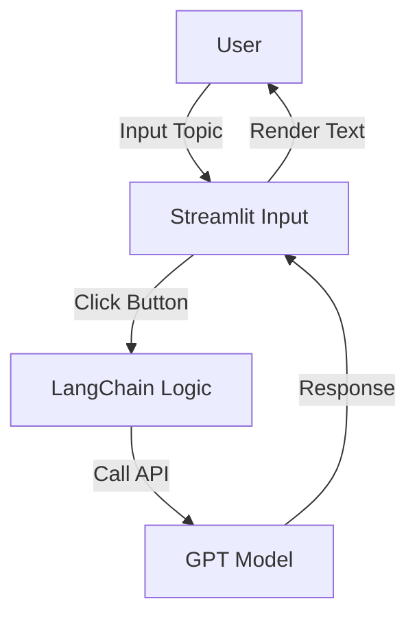

# Chapter 05 Summary

## Keywords
- **Streamlit**: Python Only 웹 프레임워크.
- **Interactive UI**: `st.text_input`, `st.button`, `st.spinner`.
- **Rapid Prototyping**: 빠른 프로토타입 제작.

## Concept
LLM 애플리케이션은 CLI보다 GUI가 사용자 경험에 훨씬 유리합니다. Streamlit은 프론트엔드 지식(HTML/CSS/JS) 없이 파이썬 코드만으로 빠르게 웹 인터페이스를 만들 수 있게 해줍니다. LLM의 입력을 받고 결과를 보여주는 데 최적화되어 있습니다.

## Analysis
### Pros & Cons
- **Pros**:
    - **생산성**: 몇 줄의 코드로 배포 가능한 웹 앱 완성.
    - **통합성**: Python 데이터 생태계(Pandas, Matplotlib 등)와 완벽 호환.
- **Cons**:
    - **커스터마이징**: 세밀한 UI/UX 디자인 수정이 어려움.
    - **상태 관리**: 복잡한 세션 관리가 React 등에 비해 까다로움.

### Application Points
- **Internal Tools**: 사내 문서 검색기, SQL 생성기 등 내부 도구.
- **MVP (Minimum Viable Product)**: 아이디어 검증을 위한 초기 서비스.
- **Dashboard**: 데이터 분석 결과와 AI 인사이트를 함께 보여주는 대시보드.

## Structure

## Flow (Simplified)
1.  **UI Rendering**: 타이틀, 입력창, 버튼 표시.
2.  **User Action**: 사용자가 주제 입력 후 버튼 클릭.
3.  **Processing**: `st.spinner`로 대기 상태 표시하며 LLM 호출.
4.  **Display**: 결과를 `st.write`로 화면에 출력.