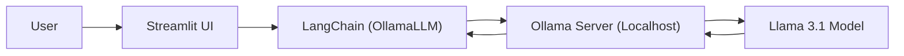

# Chapter 06 Summary

## Keywords
- **Local LLM**: 온프레미스/로컬 구동 모델 (Llama 3, Mistral 등).
- **Ollama**: 로컬 LLM 실행 및 관리를 위한 도구.
- **Privacy & Cost**: 데이터 보안 및 API 비용 절감.

## Concept
OpenAI 같은 클라우드 API에 의존하지 않고, 내 컴퓨터(또는 사내 서버)에서 직접 LLM을 돌리는 방법입니다. `Ollama`를 통해 로컬 모델을 API 서버처럼 띄우고, LangChain의 `OllamaLLM`으로 연결하여 사용합니다.

## Analysis
### Pros & Cons
- **Pros**:
    - **보안(Privacy)**: 민감한 데이터가 외부로 전송되지 않음 (기업/금융/의료).
    - **비용(Cost)**: API 사용료가 0원 (전기세 및 하드웨어 비용 제외).
    - **오프라인**: 인터넷 없이도 동작 가능.
- **Cons**:
    - **성능**: 하이엔드 상용 모델(GPT-4)보다 지능이 낮을 수 있음.
    - **자원**: 고사양 GPU/RAM 필요, 속도가 느릴 수 있음.

### Application Points
- **Private Document Search**: 사외비 문서 기반 RAG.
- **Personal Assistant**: 개인 일기장, 메모 분석 비서.
- **IoT/Edge Device**: 인터넷 연결이 불안정한 환경에서의 AI 구동.

## Structure

## Flow (Simplified)
1.  **User Input**: 이메일 주제, 수신자/발신자, 언어 선택.
2.  **Prompting**: 선택 언어(한국어/영어)에 맞춰 프롬프트 동적 생성.
3.  **Inference**: 로컬에 떠 있는 Ollama 모델에 생성 요청.
4.  **Output**: 생성된 이메일 초안 출력.