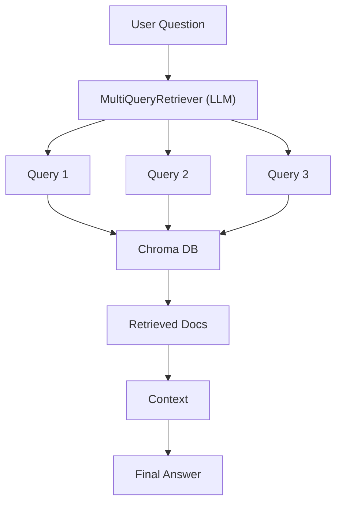

# Chapter 07 Summary

## Keywords
- **RAG (Retrieval-Augmented Generation)**: 검색 증강 생성.
- **MultiQueryRetriever**: 질문 확장 및 다중 검색.
- **PDF Loader**: 비정형 문서 처리.

## Concept
단순히 질문을 검색하는 것이 아니라, LLM을 이용해 **질문의 의도**를 파악하고 **다양한 관점**의 질문을 생성하여 검색 정확도를 높이는 기법입니다. 사용자가 "그거 어때?"라고 모호하게 물어봐도, "문맥상 A 제품의 성능은 어떠한가?" 등으로 확장하여 검색합니다.

## Analysis
### Pros & Cons
- **Pros**:
    - **정확도(Accuracy)**: 다양한 표현의 질문을 커버하여 검색 누락 감소.
    - **유연성(Flexibility)**: 사용자 질문의 퀄리티에 덜 의존함.
- **Cons**:
    - **비용(Cost)**: 질문 생성 과정에서 LLM 토큰 추가 소모.
    - **속도(Latency)**: 질문 생성 및 다중 검색으로 응답 시간 증가.

### Application Points
- **Customer Support**: 고객의 불완전한 질문을 명확하게 파악하여 매뉴얼 검색.
- **Academic Research**: 논문의 특정 주제에 대해 폭넓은 검색 수행.
- **Legal Advisory**: 판례나 법령의 다양한 해석 가능성을 고려한 검색.

## Structure

## Flow (Simplified)
1.  **Ingestion**: PDF -> Text -> Vector Store (Chroma).
2.  **Query Expansion**: User Question -> 3~5 Generated Queries.
3.  **Retrieval**: 모든 쿼리로 문서 검색 후 중복 제거(Union).
4.  **Generation**: 검색된 문서를 바탕으로 최종 답변 생성.