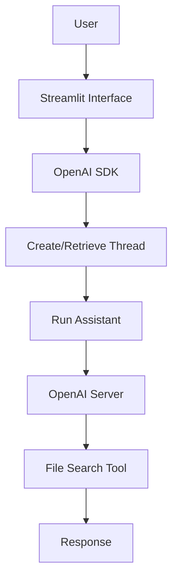

# Chapter 08 Summary

## Keywords
- **OpenAI Assistants API**: 올인원 AI 비서 개발 도구.
- **File Search**: OpenAI 자체 RAG 솔루션.
- **Thread & Run**: 대화 상태 관리(Stateful).

## Concept
LangChain과 같은 오케스트레이션 도구 없이, OpenAI가 제공하는 **Assistants API** 하나만으로 파일 검색, 대화 기억, 답변 생성을 모두 처리하는 방식입니다. 인프라 구축 없이 가장 빠르게 고성능 RAG 챗봇을 만들 수 있습니다.

## Analysis
### Pros & Cons
- **Pros**:
    - **편의성(Convenience)**: 벡터 DB, 임베딩, 검색 로직 구현 불필요.
    - **성능(Performance)**: OpenAI가 최적화한 RAG 알고리즘 사용.
    - **상태 관리**: 대화 이력(Thread)을 자동으로 관리해줌.
- **Cons**:
    - **Black Box**: 검색 과정이나 랭킹 알고리즘을 제어할 수 없음.
    - **Lock-in**: OpenAI 생태계에 종속됨.
    - **비용**: 파일 스토리지 및 검색 비용이 별도로 청구됨.

### Application Points
- **Rapid MVP**: 투자 유치용 데모, 해커톤 프로젝트.
- **Simple Chatbot**: 복잡한 로직이 필요 없는 FAQ 봇.
- **Document Q&A**: 특정 문서(약관, 계약서)에 대한 질의응답.

## Structure

## Flow (Simplified)
1.  **Assistant Setup**: "소설가 현진건" 페르소나 및 파일 업로드.
2.  **Thread**: 사용자별 대화 세션 생성.
3.  **Run**: 질문 입력 시 Assistant가 알아서 검색(File Search) 후 답변.
4.  **Polling/Streaming**: 답변 완료 대기 및 출력.