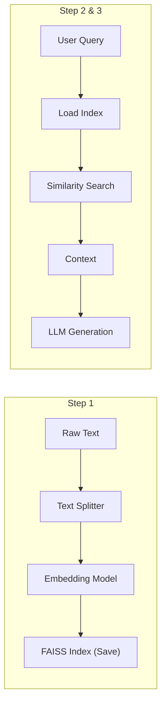

# Chapter 09-11 Summary (Local RAG Pipeline)

## Keywords
- **FAISS**: Meta의 고성능 벡터 검색 라이브러리.
- **Ingestion**: 데이터 전처리 및 적재.
- **Retrieval**: 유사도 기반 검색.
- **Generation**: 검색 기반 답변 생성.

## Concept
RAG의 전체 파이프라인(Ingestion -> Retrieval -> Generation)을 **직접 구축**해보는 과정입니다. 상용 솔루션(Assistants API)과 달리, 데이터가 어떻게 쪼개지고, 어떤 모델로 임베딩되어 저장되는지 투명하게 이해하고 제어할 수 있습니다.

## Analysis
### Pros & Cons
- **Pros**:
    - **Control**: 청크 사이즈, 임베딩 모델, 검색 알고리즘(k-NN) 등을 직접 튜닝 가능.
    - **Cost**: 오픈소스(FAISS)와 로컬 임베딩을 쓰면 비용 절감.
    - **Privacy**: 데이터가 외부로 나가지 않게 구성 가능.
- **Cons**:
    - **Complex**: 파이프라인의 모든 단계(전처리, DB 관리 등)를 직접 구현해야 함.
    - **Maintenance**: 데이터 업데이트 시 인덱스 재구축 필요.

### Application Points
- **Enterprise Knowledge Base**: 사내 위키, 기술 문서 검색 시스템.
- **Custom Search Engine**: 특정 도메인(의료, 법률)에 특화된 검색기.
- **Offline RAG**: 인터넷 없는 환경에서의 지식 검색.

## Structure

## Flow (Simplified)
1.  **Ingestion (`rag1.py`)**: 텍스트 파일 로드 -> 분할(Chunking) -> 벡터화 -> FAISS 저장.
2.  **Retrieval (`rag2.py`)**: 저장된 FAISS 로드 -> 질문 벡터화 -> 유사 문서 검색.
3.  **Chat (`rag3.py`)**: 검색된 문서를 프롬프트에 넣고 LLM에게 답변 요청.