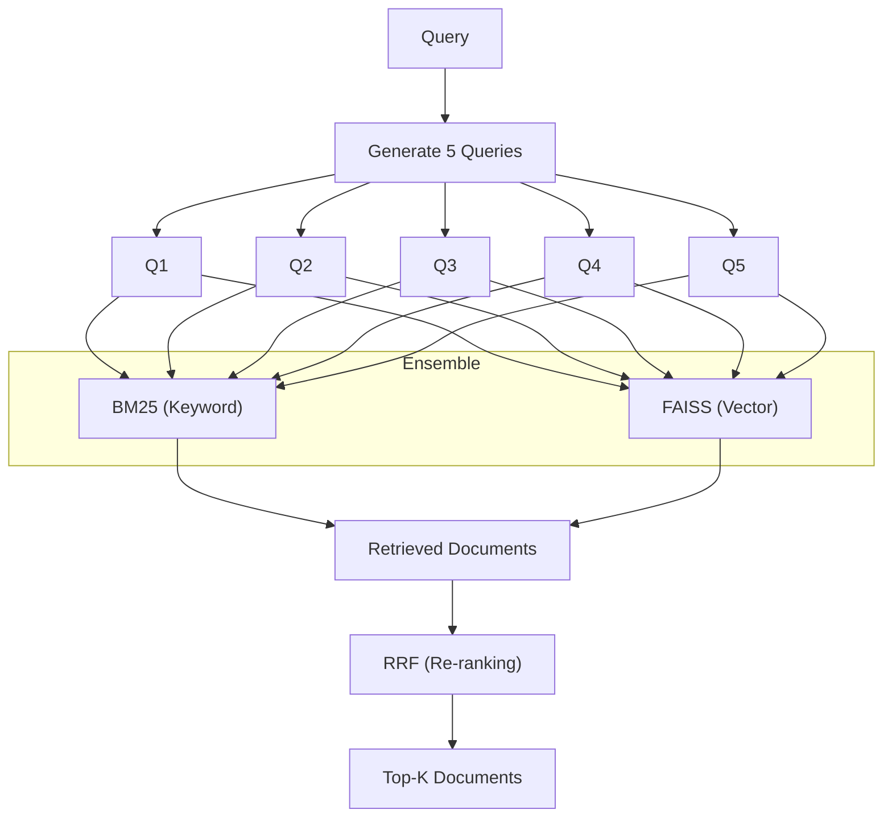

# Chapter 12-13 Summary (Advanced RAG)

## Keywords
- **Hybrid Search**: 키워드 + 벡터 검색.
- **EnsembleRetriever**: 여러 검색기의 결과 병합.
- **RAG-Fusion**: 쿼리 확장 + 재정렬(Reciprocal Rank Fusion).

## Concept
단순히 "유사한 문장"을 찾는 벡터 검색(Dense Retriever)만으로는 **고유명사**나 **특정 키워드**를 정확히 찾기 어렵습니다. 이를 보완하기 위해 전통적인 키워드 매칭(BM25, Sparse Retriever)을 함께 사용하여 **검색 품질을 극대화**하는 기법입니다. 여기에 RAG-Fusion을 더해, 질문을 다양하게 해석하고 결과를 재정렬합니다.

## Analysis
### Pros & Cons
- **Pros**:
    - **정확도(Accuracy)**: 의미적 유사성과 키워드 일치성을 동시에 고려하여, 검색 실패 확률 감소.
    - **Robustness**: 쿼리 퀄리티가 낮거나 오타가 있어도 어느 정도 커버됨.
- **Cons**:
    - **복잡성(Complexity)**: 두 가지 이상의 인덱스(BM25, FAISS)를 관리해야 함.
    - **튜닝(Tuning)**: 각 검색기의 가중치(Weight) 조절이 필요함.

### Application Points
- **E-commerce Search**: 상품명(키워드)과 상품 설명(의미)을 동시에 검색.
- **Technical Docs**: 특정 에러 코드(키워드)와 해결 방법(의미) 검색.
- **Legal/Medical**: 법률 용어(키워드)와 판례의 맥락(의미) 검색.

## Structure

## Flow (Simplified)
1.  **Preparation**: 문서를 BM25(키워드)와 FAISS(벡터) 인덱스에 각각 저장.
2.  **Query Expansion**: 사용자 질문을 5개의 다양한 질문으로 확장.
3.  **Hybrid Retrieval**: 확장된 질문들로 BM25와 FAISS 동시 검색.
4.  **Re-ranking**: 검색된 문서들의 순위를 RRF 알고리즘으로 재정렬하여 상위 문서 추출.