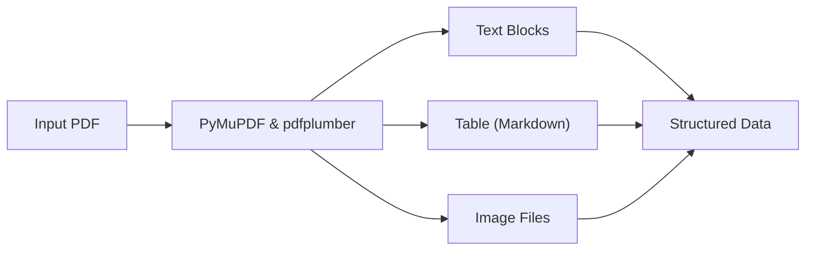

# Chapter 14 Summary (Multimodal Preprocessing)

## Keywords
- **Unstructured Data**: 비정형 데이터(PDF) 처리.
- **Layout Analysis**: 문서 구조(텍스트, 표, 이미지) 분석.
- **Extraction Pipeline**: 데이터 유형별 분리 추출.

## Concept
RAG의 성능은 **데이터의 품질**에 좌우됩니다. PDF 문서 내에 섞여 있는 텍스트, 도표(Table), 이미지(Image)를 단순히 텍스트로만 긁어오면 정보가 손실됩니다. 이를 방지하기 위해 각 요소를 **개별적으로 인식하고 추출**하여, 멀티모달 RAG를 위한 고품질 데이터를 준비하는 과정입니다.

## Analysis
### Pros & Cons
- **Pros**:
    - **정보 보존(Preservation)**: 표의 구조나 이미지의 시각 정보를 놓치지 않음.
    - **Context**: 텍스트와 이미지가 섞인 복잡한 문서(논문, 보고서) 처리에 필수적.
- **Cons**:
    - **난이도**: 레이아웃 분석 자체가 기술적으로 어렵고, 라이브러리(PyMuPDF 등) 의존도가 높음.
    - **속도**: 단순 텍스트 추출보다 시간이 오래 걸림.

### Application Points
- **Financial Analysis**: 재무제표의 복잡한 표 데이터 추출.
- **Manual QA**: 제품 매뉴얼의 도면이나 조립도 이미지 활용.
- **Paper Summary**: 논문의 실험 결과 그래프 및 도표 해석.

## Structure

## Flow (Simplified)
1.  **Load**: PDF 파일 열기.
2.  **Iterate**: 각 페이지를 순회하며 요소 탐색.
3.  **Extract**:
    - **Text**: `fitz`로 텍스트 블록 추출.
    - **Table**: `pdfplumber`로 표 인식 후 Markdown 변환.
    - **Image**: `fitz`로 이미지 바이트 추출 및 저장.
4.  **Output**: 분류된 리스트(Texts, Tables) 반환.