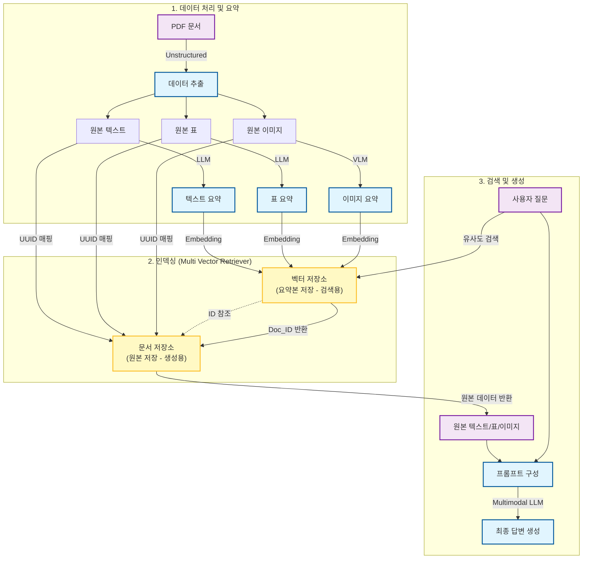

# 멀티모달 RAG (Multi-modal RAG) 핵심 정리

## 1. 개요 (Overview)
멀티모달 RAG는 텍스트뿐만 아니라 표, 이미지(차트, 그래프 등)가 포함된 복합 문서(PDF 등)를 처리하여 질의응답을 수행하는 기술입니다. 단순히 텍스트만 검색하는 기존 RAG와 달리, 시각적 정보를 이해하는 비전 모델(VLM)을 활용하여 이미지 데이터를 텍스트와 함께 문맥으로 활용합니다.

## 2. 주요 구조 및 프로세스 (Structure & Process)

이 시스템은 크게 **데이터 추출**, **요약 및 인덱싱**, **검색**, **생성**의 4단계로 구성됩니다.

### 1) 데이터 추출 (Data Extraction)
*   **도구**: `unstructured` 라이브러리 활용 (`partition_pdf`)
*   **기능**: PDF 문서 내에서 **텍스트(Text)**, **표(Table)**, **이미지(Image)** 요소를 각각 분리하여 추출합니다.
*   **처리**: 텍스트는 청크(Chunk)로 분할하고, 이미지는 파일로 저장하거나 Base64로 인코딩합니다.

### 2) 요약 생성 (Summarization)
검색의 정확도를 높이기 위해 각 요소에 대한 '요약본'을 생성합니다.
*   **텍스트/표**: LLM(GPT-4, Llama 3.1 등)을 사용하여 내용을 요약합니다.
*   **이미지**: VLM(GPT-4 Vision, LLaVA 등)을 사용하여 이미지의 시각적 정보를 텍스트로 설명(Description)하는 요약을 생성합니다.

### 3) 멀티 벡터 검색기 (Multi Vector Retriever) 구성
이 구조의 핵심은 **검색 대상(Search Key)**과 **반환 대상(Return Value)**을 분리하는 것입니다.
*   **벡터 저장소 (Vector Store)**: 생성된 **'요약본(Summary)'**을 임베딩하여 저장합니다. (검색 용도)
*   **문서 저장소 (Doc Store)**: 실제 **'원본 데이터(Raw Text/Image)'**를 저장합니다. (생성 용도)
*   **작동 원리**: 사용자의 질문과 유사한 '요약본'을 벡터 검색으로 찾은 후, 그와 연결(UUID)된 '원본 이미지/텍스트'를 반환합니다.

### 4) 생성 (Generation)
*   검색된 원본 이미지(Base64)와 텍스트들을 하나의 프롬프트로 구성합니다.
*   멀티모달 LLM(GPT-4 Vision, LLaVA 등)에게 전달하여, 텍스트와 이미지를 모두 참고한 최종 답변을 생성합니다.

### 5) 프로세스 흐름도 (Process Flowchart)
아래 다이어그램은 데이터 추출부터 답변 생성까지의 전체 흐름을 시각적으로 보여줍니다.

## 3. 핵심 포인트 (Key Points)
1.  **Multi Vector Retriever 전략**: 이미지를 직접 임베딩하여 검색하는 대신, 이미지를 설명하는 '텍스트 요약'을 검색에 사용하여 의미론적 검색 정확도를 높입니다.
2.  **원본 이미지 활용 (Context Preservation)**: 최종 답변 생성 시에는 요약본이 아닌 **원본 이미지**를 모델에 입력하여, 요약에서 누락될 수 있는 세부 수치나 추세(Trend) 정보를 모델이 직접 보고 판단하게 합니다.
3.  **하이브리드 모델 활용**:
    *   **Cloud**: OpenAI (GPT-4 Vision, Embeddings)
    *   **Local**: Ollama (LLaVA for Image Summary, Llama 3 for Text Gen)
    *   상황에 따라 클라우드와 로컬 모델을 혼합하여 구성 가능합니다.

## 4. 응용 포인트 (Applications)
*   **금융 리포트 분석**: 주가 변동 그래프, 환율 차트, 재무제표 표가 혼재된 문서에서 "주가 하락의 원인과 추세"를 묻는 질문에 대해 텍스트와 그래프를 종합하여 답변.
*   **기술/제조 매뉴얼**: 부품 분해도가 포함된 설명서에서 특정 부품의 위치나 조립 방법을 시각적 자료와 함께 설명.
*   **의료/연구 논문**: 실험 데이터 차트와 본문 텍스트를 교차 검증하여 연구 결과 요약.
