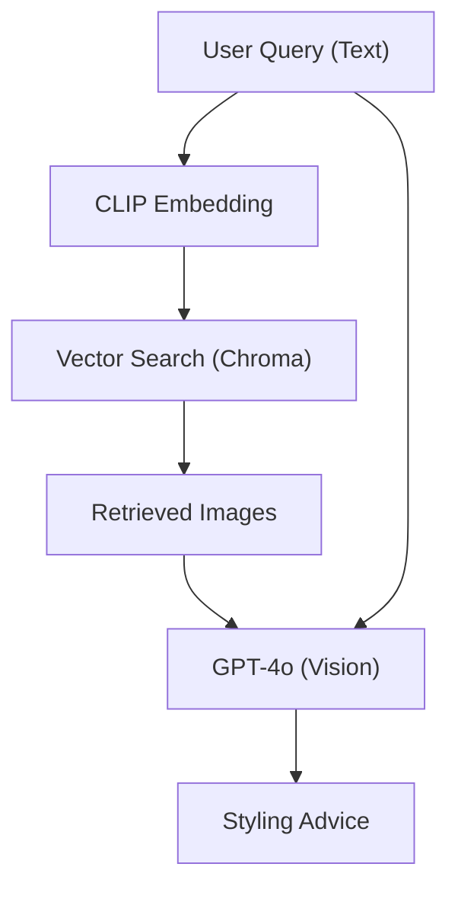

# Chapter 15 Summary (Fashion Multimodal RAG)

## Keywords
- **CLIP (Contrastive Language-Image Pre-training)**: 텍스트-이미지 멀티모달 임베딩.
- **VQA (Visual Question Answering)**: 이미지를 보고 질문에 답하기.
- **Text-to-Image Search**: 텍스트로 이미지 검색.

## Concept
"청바지에 어울리는 셔츠 찾아줘"라고 물었을 때, 텍스트뿐만 아니라 **이미지**를 검색 결과로 보여주고, 그 이미지를 **AI가 보고(Vision)** 스타일링 조언을 해주는 멀티모달 서비스입니다. CLIP 모델을 사용하여 텍스트와 이미지를 같은 벡터 공간에 매핑함으로써 가능해집니다.

## Analysis
### Pros & Cons
- **Pros**:
    - **직관성(Intuitive)**: 백마디 말보다 한 장의 사진이 더 효과적인 도메인(패션, 인테리어)에 최적.
    - **Searchability**: 태그가 없는 이미지도 내용(의미)만으로 검색 가능.
- **Cons**:
    - **비용**: 멀티모달 모델(GPT-4o)의 추론 비용이 텍스트 모델보다 비쌈.
    - **데이터**: 고품질 이미지 데이터셋과 임베딩 인프라 필요.

### Application Points
- **Fashion/Retail**: "이 옷이랑 비슷한 거 찾아줘", "이 가구랑 어울리는 소파 추천해줘".
- **Contents Creation**: 텍스트 설명에 맞는 이미지/비디오 자료 검색.
- **Smart Factory**: 불량 예시 이미지를 기반으로 유사 불량 검색 및 원인 분석.

## Structure

## Flow (Simplified)
1.  **Indexing**: 패션 이미지들을 CLIP으로 벡터화하여 DB 저장.
2.  **Search**: 사용자 질문(Text)을 벡터화하여 유사한 이미지 검색.
3.  **Reasoning**: 검색된 이미지와 질문을 GPT-4o에게 전달.
4.  **Response**: GPT-4o가 이미지를 분석하여 스타일링 조언 생성.