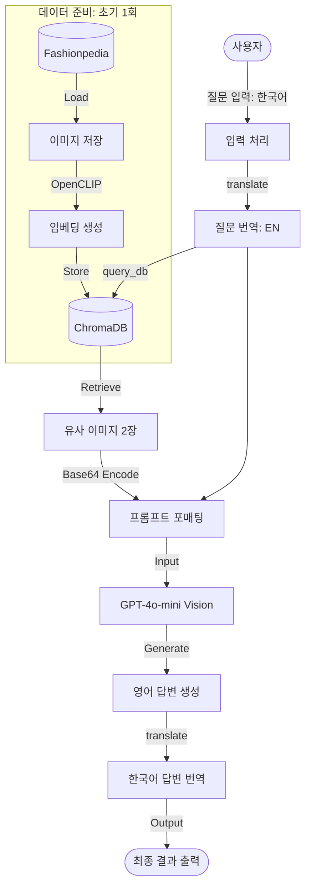
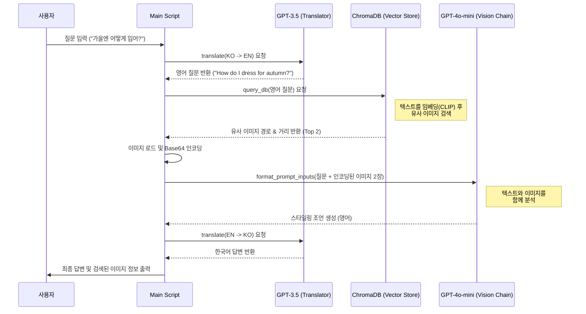

# Fashion RAG (LangChain + ChromaDB + GPT-4o-mini Vision) 스크립트 분석

## 1. 개요 (Overview)
이 스크립트는 **Fashionpedia** 데이터셋의 이미지를 사용하여 멀티모달 RAG (Retrieval-Augmented Generation) 시스템을 구축합니다. 사용자의 자연어 질문(스타일링 조언 등)에 대해 관련된 이미지를 검색하고, 그 이미지를 GPT-4o-mini Vision 모델에 제공하여 구체적인 조언을 생성합니다.

## 2. 주요 구조 및 흐름 (Structure & Flow)

### 2.1 주요 구성 요소 (Components)

*   **데이터셋 준비 (Dataset Setup)**
    *   `setup_dataset()`: HuggingFace의 `detection-datasets/fashionpedia` 데이터셋을 로드합니다.
    *   `save_images()`: 데이터셋에서 이미지를 추출하여 로컬 폴더(`fashion_dataset`)에 저장합니다.

*   **벡터 데이터베이스 (Vector Database - ChromaDB)**
    *   `setup_chroma_db()`: 로컬 ChromaDB 클라이언트를 초기화하고, **OpenCLIP** 모델을 임베딩 함수로 사용하는 컬렉션을 생성합니다.
    *   `add_images_to_db()`: 저장된 이미지들을 CLIP 모델로 임베딩하여 벡터 DB에 저장합니다. (이미지와 텍스트 간의 의미적 유사성을 검색 가능하게 함)
    *   `query_db()`: 사용자의 텍스트 쿼리와 가장 유사한 이미지를 검색합니다.

*   **비전 체인 (Vision Chain - LangChain)**
    *   `setup_vision_chain()`: GPT-4o-mini 모델을 사용하여 이미지와 텍스트를 함께 입력받는 체인을 구성합니다.
    *   `format_prompt_inputs()`: 검색된 이미지를 Base64로 인코딩하여 GPT-4o-mini에 전달할 수 있는 포맷으로 변환합니다.

*   **유틸리티 (Utilities)**
    *   `translate()`: 사용자의 한국어 입력을 영어로, GPT의 영어 응답을 한국어로 번역합니다 (GPT-3.5-turbo 사용).

### 2.2 실행 흐름 (Execution Flow)

1.  **초기화:** 데이터셋 다운로드 및 이미지 저장 -> 벡터 DB 구축 (이미지 임베딩 저장).
2.  **사용자 입력:** "가을엔 어떻게 입어?"와 같은 질문 입력.
3.  **번역 (KO -> EN):** 질문을 영어로 번역 ("How do I dress for autumn?").
4.  **이미지 검색 (Retrieval):** 번역된 질문으로 벡터 DB에서 가장 유사한 이미지 2장 검색.
5.  **프롬프트 구성:** 검색된 이미지(Base64)와 질문을 결합하여 멀티모달 프롬프트 생성.
6.  **비전 모델 호출 (Generation):** GPT-4o-mini가 이미지를 보고 스타일링 조언 생성.
7.  **번역 (EN -> KO):** 영어 응답을 다시 한국어로 번역.
8.  **결과 출력:** 검색된 이미지 정보와 최종 답변 출력.

---

## 3. 핵심 포인트 (Key Points)

1.  **OpenCLIP 임베딩:**
    *   텍스트와 이미지를 동일한 벡터 공간에 매핑하는 **CLIP (Contrastive Language-Image Pre-training)** 모델을 사용합니다.
    *   이를 통해 "가을 코트"라는 텍스트 쿼리로 실제 코트 이미지를 검색할 수 있습니다.

2.  **멀티모달 RAG:**
    *   기존 RAG는 텍스트 문서만 검색하지만, 이 시스템은 **이미지를 검색**하여 LLM(Large Language Model)의 컨텍스트로 제공합니다.
    *   LLM은 텍스트 지식뿐만 아니라 **검색된 시각 정보**를 바탕으로 답변하므로 더 구체적이고 맥락에 맞는 조언이 가능합니다.

3.  **LangChain의 활용:**
    *   `ChatPromptTemplate`을 사용하여 텍스트와 이미지가 혼합된 복잡한 프롬프트를 구조화합니다.
    *   `LCEL (LangChain Expression Language)` 스타일의 파이프라인(`|`)을 사용하여 체인을 간결하게 정의합니다.

---

## 4. 다이어그램 (Diagram)

다음은 스크립트의 전체적인 실행 흐름을 시각화한 다이어그램입니다.

## 5. 시퀀스 다이어그램 (Sequence Diagram)

다음은 각 단계별 요소들 간의 상호작용을 나타낸 시퀀스 다이어그램입니다.

