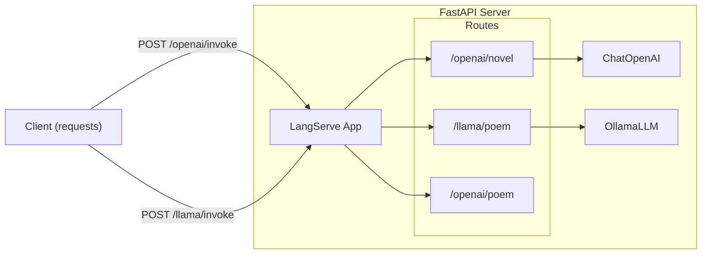

# Chapter 16 Summary (LangServe)

## Keywords
- **LangServe**: LangChain 배포용 라이브러리.
- **FastAPI**: 고성능 Python 웹 프레임워크.
- **REST API**: 표준화된 API 인터페이스.

## Concept
로컬에서 잘 돌아가는 LangChain 코드를 **실제 서비스**로 내보내려면 API 서버가 필요합니다. LangServe는 복잡한 API 개발 과정 없이, LangChain 객체(Chain, Runnable)를 단 몇 줄의 코드로 **프로덕션 수준의 REST API**로 변환해줍니다.

## Analysis
### Pros & Cons
- **Pros**:
    - **Speed**: `add_routes` 한 줄로 `/invoke`, `/stream`, `/batch` 엔드포인트 자동 생성.
    - **Interoperability**: 클라이언트(React, JS)와의 연동이 매우 쉬움.
    - **Documentation**: Swagger UI(`/docs`)가 자동으로 생성됨.
- **Cons**:
    - **Dependency**: FastAPI 생태계에 종속적.
    - **Customization**: 정해진 규격 외의 복잡한 커스텀 로직 구현은 FastAPI 지식 필요.

### Application Points
- **MSA (Microservices Architecture)**: 각 체인(번역, 요약, 검색)을 독립된 마이크로서비스로 배포.
- **Mobile App Backend**: 앱에서 호출할 AI 기능 API 서버.
- **Internal API Gateway**: 사내의 모든 LLM 기능을 통합하여 관리.

## Structure

## Flow (Simplified)
1.  **Define**: FastAPI 앱 생성 (`app = FastAPI()`).
2.  **Chain**: LLM과 프롬프트를 연결하여 체인 생성.
3.  **Route**: `add_routes(app, chain, path="/...")`로 API 등록.
4.  **Serve**: `uvicorn`으로 서버 실행.