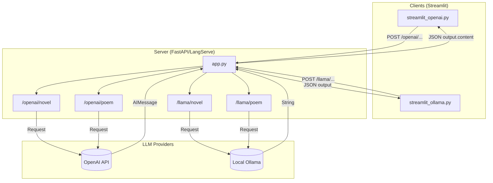
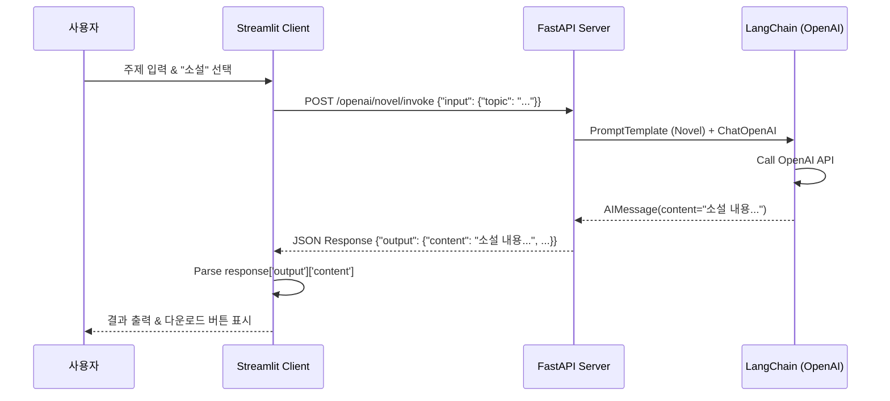

# AI 작가 에이전트 (LangChain + FastAPI + Streamlit) 분석

## 1. 개요 (Overview)
이 프로젝트는 **LangChain**, **FastAPI (LangServe)**, **Streamlit**을 사용하여 시와 소설을 창작하는 AI 에이전트를 구현합니다. 사용자는 Streamlit 웹 인터페이스를 통해 주제와 장르(시/소설)를 선택하고, 백엔드 서버(FastAPI)는 **OpenAI (GPT-3.5)** 또는 **Ollama (Llama 3.1)** 모델을 사용하여 콘텐츠를 생성합니다.

특히 이 프로젝트는 상용 API(OpenAI)와 로컬 LLM(Ollama)의 응답 형식 차이를 이해하고, 각각에 맞는 클라이언트 처리를 구현하는 방법을 보여줍니다.

## 2. 주요 구조 및 흐름 (Structure & Flow)

### 2.1 파일 구성 (File Structure)

*   **`app.py` (Server)**
    *   FastAPI와 LangServe를 사용하여 REST API 서버를 구축합니다.
    *   **OpenAI (`ChatOpenAI`)** 와 **Ollama (`OllamaLLM`)** 두 가지 모델을 초기화합니다.
    *   시와 소설 작성을 위한 프롬프트 템플릿(`ChatPromptTemplate`)을 정의합니다.
    *   `add_routes`를 통해 각 모델과 프롬프트를 결합한 Chain을 API 엔드포인트로 노출합니다.
        *   `/openai/novel`, `/openai/poem`
        *   `/llama/novel`, `/llama/poem`

*   **`streamlit_openai.py` (Client 1)**
    *   OpenAI 모델을 사용하는 Streamlit 클라이언트입니다.
    *   OpenAI의 응답 구조(`AIMessage`)에 맞춰 결과를 파싱합니다.

*   **`streamlit_ollama.py` (Client 2)**
    *   Ollama 모델을 사용하는 Streamlit 클라이언트입니다.
    *   Ollama의 응답 구조(Raw Text)에 맞춰 결과를 파싱합니다.

### 2.2 실행 흐름 (Execution Flow)

1.  **서버 실행:** `app.py`를 실행하여 `http://localhost:8000`에서 API 서버를 시작합니다.
2.  **클라이언트 실행:** Streamlit 앱(`streamlit_openai.py` 또는 `streamlit_ollama.py`)을 실행합니다.
3.  **사용자 입력:** 웹 UI에서 '주제'를 입력하고 '소설' 또는 '시'를 선택한 후 요청 버튼을 클릭합니다.
4.  **API 요청:** 클라이언트는 선택된 옵션에 따라 적절한 API 엔드포인트(`/invoke`)로 POST 요청을 보냅니다.
5.  **콘텐츠 생성:** 서버는 LangChain을 통해 LLM을 호출하고, 생성된 텍스트를 반환합니다.
6.  **결과 출력:** 클라이언트는 응답 JSON을 파싱하여 화면에 표시하고, 텍스트 파일 다운로드 기능을 제공합니다.

---

## 3. 핵심 포인트 (Key Points)

1.  **모델별 응답 형식의 차이 (Output Format Differences):**
    *   **OpenAI (`ChatOpenAI`):** LangChain의 `AIMessage` 객체를 반환합니다. LangServe를 통해 JSON으로 직렬화될 때, 내용이 `output.content` 필드에 담깁니다.
        *   Client 처리: `response.json().get('output', {}).get('content')`
    *   **Ollama (`OllamaLLM`):** 텍스트 문자열(String)을 직접 반환합니다.
        *   Client 처리: `response.json()['output']`

2.  **LangServe (`add_routes`):**
    *   복잡한 API 구현 없이 LangChain의 Runnable(Chain)을 쉽게 REST API로 변환해줍니다.
    *   `/invoke`, `/batch`, `/stream` 등의 표준 엔드포인트를 자동으로 생성합니다.

3.  **버그 노트 (Bug Note):**
    *   `app.py`에서 `/llama/novel` 엔드포인트가 실수로 소설 프롬프트(`prompt2`) 대신 시 프롬프트(`prompt3`)를 사용하도록 설정되어 있습니다. (실제 실행 시 소설 요청에도 시가 생성될 수 있음)
    *   `add_routes(app, prompt3 | llamaModel, path="/llama/novel")` -> `prompt2`로 수정 필요.

---

## 4. 다이어그램 (Diagrams)

### 4.1 시스템 아키텍처 (Architecture)

### 4.2 시퀀스 다이어그램 (Sequence Diagram)

다음은 **OpenAI 소설 생성** 요청 시의 흐름입니다.

