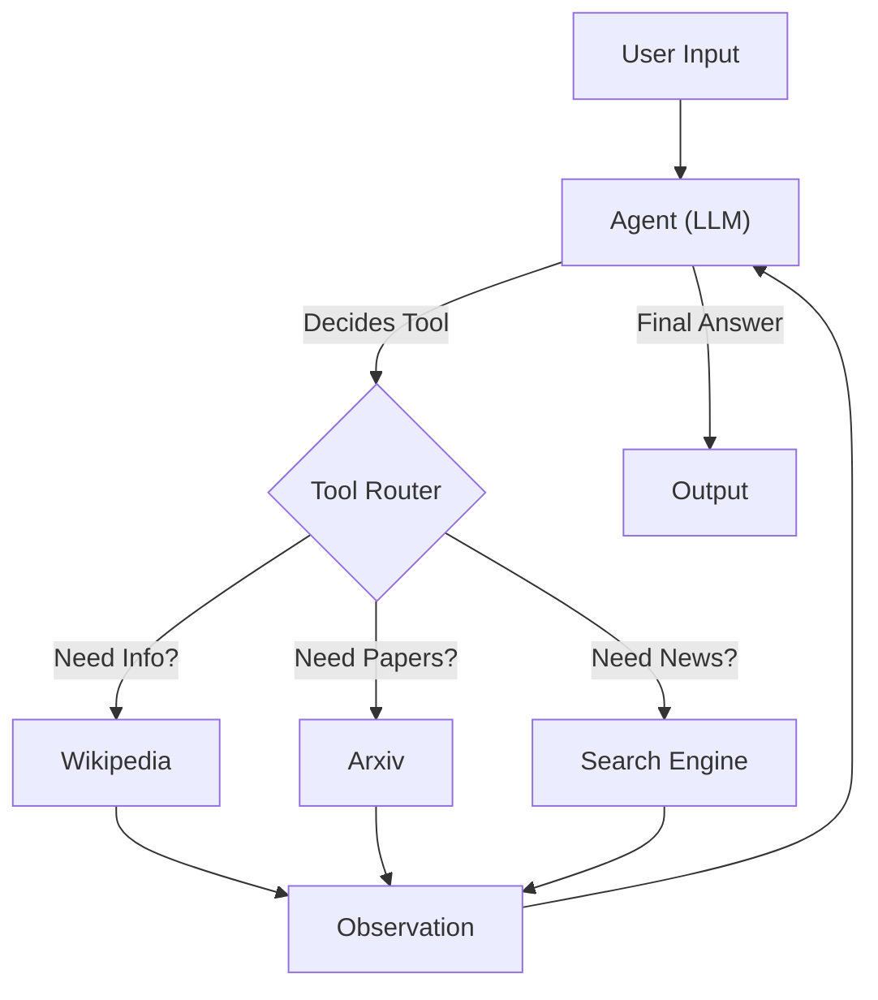

# Chapter 17 Summary (LangChain Agents)

## Keywords
- **Agent**: 도구 사용 결정권자(Reasoning Engine).
- **Tools**: 외부 세계와의 인터페이스 (Search, Calculator, API).
- **ReAct (Reasoning + Acting)**: 생각하고 행동하는 패턴.

## Concept
미리 정해진 순서대로만 움직이는 Chain과 달리, **Agent**는 **상황에 따라 필요한 도구를 스스로 선택**하고 실행 순서를 결정합니다. "오늘 날씨 어때?"라고 물으면 검색 도구를, "23*54는?"이라고 물으면 계산기를 사용하는 식입니다. LLM의 두뇌를 활용해 **자율적인 문제 해결**을 가능하게 합니다.

## Analysis
### Pros & Cons
- **Pros**:
    - **Flexibility**: 예측 불가능한 사용자 질문에도 유연하게 대처 가능.
    - **Power**: 인터넷 검색, DB 조회 등 외부 데이터/기능 활용 가능.
- **Cons**:
    - **Unpredictability**: 가끔 엉뚱한 도구를 쓰거나 무한 루프에 빠질 수 있음.
    - **Latency**: 여러 번의 추론(Thought) 과정을 거치므로 단순 Chain보다 느림.

### Application Points
- **Personal Assistant**: 일정 관리, 이메일 전송, 정보 검색을 수행하는 비서.
- **Data Analyst**: CSV 파일 분석, SQL 쿼리 실행, 차트 그리기를 수행하는 분석가.
- **Auto-GPT**: 자율적으로 목표를 설정하고 달성해나가는 에이전트.

## Structure

## Flow (Simplified)
1.  **Tools**: 사용할 도구들(Wiki, Arxiv 등) 정의.
2.  **Agent**: LLM + Tools + Prompt 결합.
3.  **Run**: 질문 입력 -> Agent가 도구 선택 -> 실행 결과 관찰 -> 최종 답변.