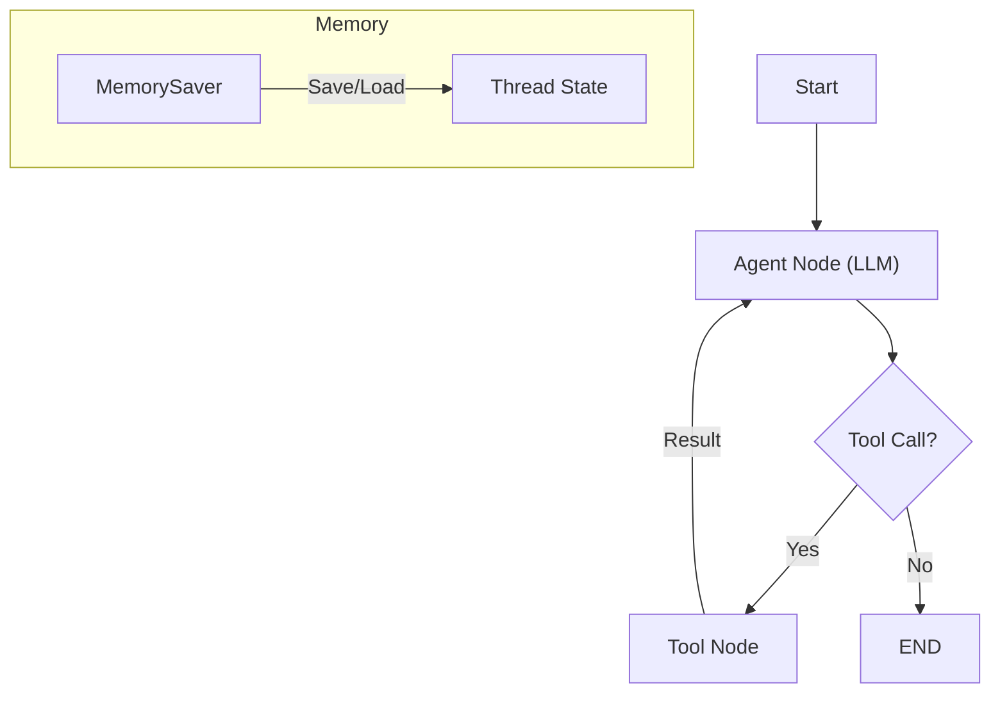

# Chapter 18 Summary (LangGraph Basics)

## Keywords
- **LangGraph**: 상태(State) 기반 순환 그래프 프레임워크.
- **StateGraph**: 노드(Node)와 엣지(Edge)로 정의된 워크플로우.
- **MemorySaver**: 대화 문맥 유지(Checkpointer).

## Concept
기존 LangChain Agent의 블랙박스 구조(내부를 들여다보거나 제어하기 어려움)를 해결하기 위해 등장했습니다. 에이전트의 사고 과정을 **그래프(Graph)** 형태로 명시적으로 정의하고, **상태(State)** 를 통해 데이터 흐름을 정교하게 제어합니다. 특히 **순환(Loop)** 구조와 **분기(Branching)** 처리에 강력합니다.

## Analysis
### Pros & Cons
- **Pros**:
    - **Control**: 에이전트의 모든 행동 단계(노드)를 개발자가 직접 정의/수정 가능.
    - **Stateful**: 대화의 상태를 지속적으로 추적하고 관리(Memory)하기 용이함.
    - **Debugging**: 그래프 시각화를 통해 로직의 흐름을 파악하기 쉬움.
- **Cons**:
    - **Learning Curve**: 그래프 이론과 상태 관리에 대한 이해가 필요하여 초기 진입 장벽이 높음.
    - **Verbosity**: 단순한 로직 구현에는 코드가 다소 길어질 수 있음.

### Application Points
- **Complex Chatbot**: 고객 상담 시나리오가 복잡하고 분기가 많은 챗봇.
- **Interactive Storytelling**: 사용자의 선택에 따라 스토리가 달라지는 게임.
- **Multi-turn Task**: 여러 단계의 대화를 거쳐 정보를 수집해야 하는 예약 시스템.

## Structure

## Flow (Simplified)
1.  **Graph**: `StateGraph` 생성 및 상태 스키마 정의.
2.  **Nodes**: LLM 호출(`agent`)과 도구 실행(`tools`) 노드 정의.
3.  **Edges**: 조건부 엣지(`should_continue`)로 순환 또는 종료 결정.
4.  **Compile & Run**: 그래프 컴파일 후 실행.