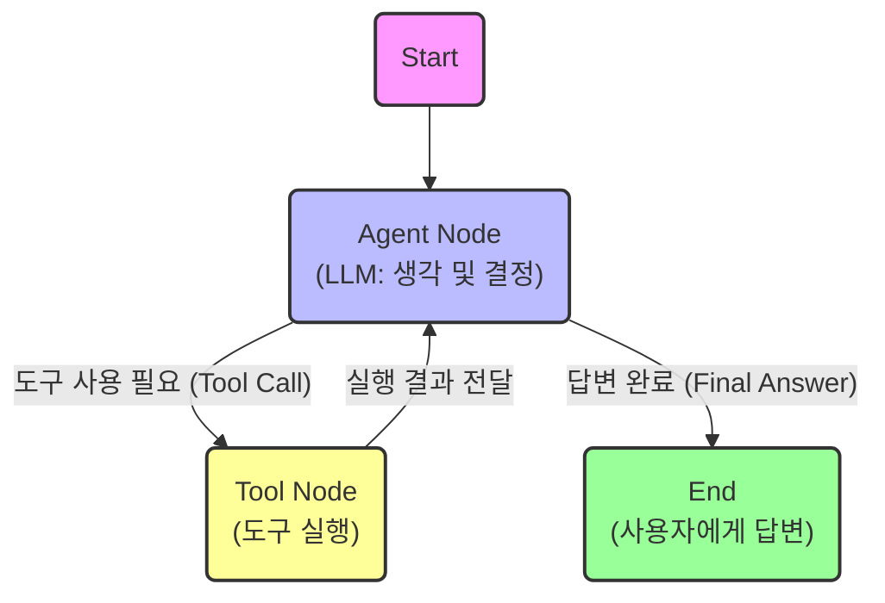

# Chapter 18: LangGraph 기초 - 상태 기반 에이전트 구축

이 문서는 `ch18`의 예제를 통해 **LangGraph**의 핵심 개념과 동작 원리를 설명합니다. LangGraph는 단순한 선형적인 체인(Chain)을 넘어, **순환(Cycle)**과 **상태(State)**를 가진 복잡한 에이전트 워크플로우를 구축하기 위한 도구입니다.

---

## 1. 핵심 개념 및 키워드 (Core Concepts)

LangGraph를 이해하기 위해 꼭 알아야 할 주요 구성 요소들입니다.

*   **State (상태)**
    *   그래프 내의 노드들이 공유하는 데이터 저장소입니다.
    *   이 예제에서는 `MessagesState`를 사용하여 대화의 기록(Messages)을 상태로 관리하며, 각 단계마다 새로운 메시지가 리스트에 추가(append)되는 방식으로 동작합니다.

*   **Node (노드)**
    *   실질적인 작업을 수행하는 단위입니다.
    *   **Agent Node**: LLM(GPT)을 호출하여 사용자의 입력을 처리하고, 답변을 생성하거나 도구 호출(Tool Call)을 결정합니다.
    *   **Tool Node**: LLM이 요청한 도구(함수)를 실제로 실행하고 결과를 반환합니다.

*   **Edge (엣지)**
    *   노드와 노드 사이의 연결선으로, 흐름의 방향을 정의합니다.
    *   **Normal Edge**: 항상 정해진 다음 노드로 이동합니다. (예: `Tools` -> `Agent`)
    *   **Conditional Edge (조건부 엣지)**: 특정 조건이나 로직에 따라 다음 경로를 동적으로 결정합니다. (예: LLM이 도구를 쓰자고 했는가? -> `Tools`로 이동, 아니면 -> `End`로 이동)

*   **Graph (그래프)**
    *   상태, 노드, 엣지를 모두 포함하는 전체 워크플로우 정의입니다. (`StateGraph`)

*   **Checkpointer / Memory (체크포인터)**
    *   그래프의 실행 상태를 저장하고 불러오는 기능입니다. (`MemorySaver`)
    *   `thread_id`를 통해 사용자별 세션을 구분하고, 대화가 끊겨도 이전 문맥(Context)을 기억하게 합니다.

---

## 2. 구조와 흐름 (Structure & Flow)

이 예제는 **순환 구조(Cyclic Graph)**를 가집니다. 에이전트가 도구를 사용하고 그 결과를 바탕으로 다시 생각(Re-reasoning)하는 과정이 반복될 수 있기 때문입니다.

### 흐름 상세 설명
1.  **시작**: 사용자의 질문("불고기 레시피 알려줘")이 들어오면 그래프가 시작됩니다.
2.  **Agent (LLM)**: 질문을 분석합니다. 자신이 직접 답할 수 없거나 더 정확한 정보가 필요하면 **도구 호출**을 결정합니다.
3.  **분기 (Conditional Edge)**:
    *   LLM이 도구 사용을 요청했다면 -> **Tool Node**로 이동.
    *   LLM이 답변을 완성했다면 -> **End**로 이동하여 종료.
4.  **Tools**: 요청된 함수(`recommend_recipe`)를 실행하고 결과를 얻습니다. **중요한 점은 여기서 끝나는 것이 아니라, 다시 Agent로 돌아간다는 것입니다.**
5.  **Agent (재진입)**: 도구의 실행 결과를 보고 최종 답변을 정리하여 사용자에게 전달합니다.

---

## 3. 중요 포인트 (Key Points)

1.  **순환성 (Cyclic Capability)**
    *   기존의 `LangChain` 체인은 주로 단방향(DAG)이었지만, `LangGraph`는 **루프(Loop)**를 허용합니다. 이는 에이전트가 문제를 해결할 때까지 "생각 -> 행동 -> 관찰" 과정을 반복할 수 있게 해줍니다.

2.  **제어 가능성 (Controllability)**
    *   개발자가 흐름을 명시적으로 제어할 수 있습니다. `should_continue` 함수처럼 파이썬 코드로 분기 로직을 직접 작성하므로, 복잡한 비즈니스 로직을 반영하기 쉽습니다.

3.  **지속성 (Persistence)**
    *   `checkpointer`를 사용함으로써, 챗봇은 단순히 일회성 응답을 주는 것이 아니라 **대화의 맥락을 유지**합니다. "아까 그거 뭐였지?" 같은 질문에 대답할 수 있는 이유입니다.

---

## 4. 결론
이 예제는 LangGraph의 가장 기초적인 패턴인 **"Tool Calling Agent"**를 보여줍니다. LLM이 스스로 판단하여 외부 도구를 사용하고, 그 결과를 바탕으로 사용자와 상호작용하는 지능형 애플리케이션의 기본 골격입니다.
