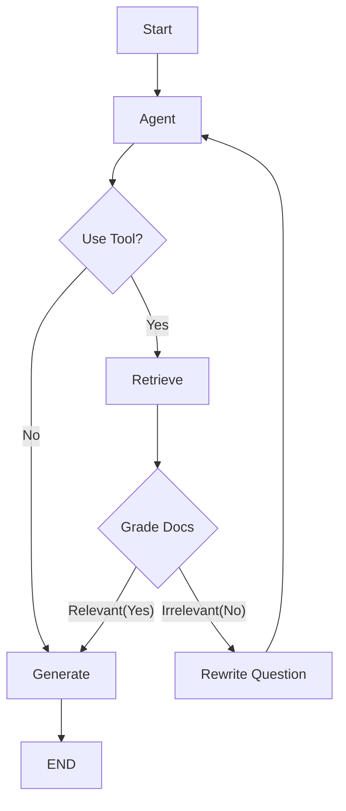

# Chapter 19 Summary (Agentic RAG)

## Keywords
- **Agentic RAG**: 능동적/반성적 RAG.
- **Self-Correction**: 스스로 오류를 수정하는 루프.
- **Retrieval Grading**: 검색 결과의 품질 평가.

## Concept
RAG의 고질적인 문제인 "검색 실패"나 "환각(Hallucination)"을 해결하기 위한 고급 패턴입니다. 한 번 검색하고 끝내는 것이 아니라, **"이 문서가 정말 질문에 적합한가?"** 를 스스로 평가하고, 부족하다면 **질문을 고쳐서 다시 검색**하는 **자기 교정(Self-Correction)** 메커니즘을 도입했습니다.

## Analysis
### Pros & Cons
- **Pros**:
    - **Reliability**: 잘못된 문서를 기반으로 답변하는 것을 방지하여 신뢰도 향상.
    - **Adaptive**: 사용자의 질문이 모호해도 재작성 과정을 통해 정확한 정보를 찾아냄.
- **Cons**:
    - **Latency**: 평가 및 재검색 과정이 추가되어 응답 속도가 느림.
    - **Cost**: 여러 번의 LLM 호출(평가, 재작성, 생성)로 비용 증가.

### Application Points
- **High-Stakes Domain**: 의료, 법률, 금융 등 정확도가 매우 중요한 분야.
- **Research Assistant**: 복잡한 주제에 대해 깊이 있는 조사가 필요한 경우.
- **Fact Checking**: 뉴스 기사나 주장의 사실 여부를 검증하는 시스템.

## Structure

## Flow (Simplified)
1.  **Retrieve**: 질문에 대해 문서 검색.
2.  **Grade**: 검색된 문서가 질문과 관련 있는지 LLM이 채점(Yes/No).
3.  **Correction**:
    - **Yes**: 답변 생성(`Generate`).
    - **No**: 질문 재작성(`Rewrite`) 후 다시 검색.