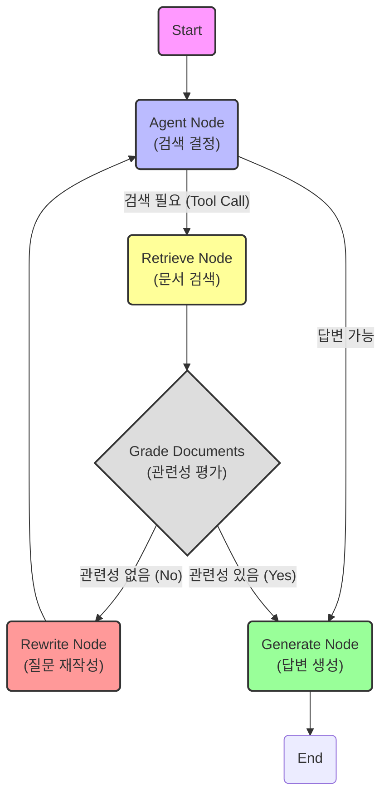

# summary.md

이 문서는 `ch19`의 예제를 통해 **Agentic RAG (Self-Reflective RAG)**의 개념과 동작 원리를 설명합니다. 단순한 RAG(검색 증강 생성)를 넘어, 에이전트가 스스로 검색 결과의 품질을 평가하고, 질문을 재작성하여 더 나은 답변을 찾아가는 **능동적인 워크플로우**를 구축합니다.

---

## 1. 핵심 개념 및 키워드 (Core Concepts)

Agentic RAG를 이해하기 위한 주요 구성 요소들입니다.

*   **Self-Reflection (자기 성찰/교정)**
    *   에이전트가 자신이 검색한 결과나 생성한 답변이 적절한지 스스로 평가하는 과정입니다.
    *   이 예제에서는 `grade_documents` 함수가 검색된 문서가 사용자 질문과 관련이 있는지 평가합니다.

*   **Query Rewriting (질문 재작성)**
    *   초기 검색 결과가 좋지 않을 경우, LLM이 질문을 더 나은 방향으로 수정하여 다시 검색을 시도합니다. (`rewrite` 노드)

*   **Adaptive Routing (적응형 라우팅)**
    *   상황에 따라 흐름을 동적으로 바꿉니다.
    *   검색 결과가 좋으면 -> 답변 생성(`generate`)
    *   검색 결과가 나쁘면 -> 질문 수정(`rewrite`) 후 다시 검색

*   **Agent State (에이전트 상태)**
    *   `AgentState` 클래스를 통해 대화의 전체 기록(`messages`)을 관리하며, 이를 기반으로 각 단계에서 판단을 내립니다.

---

## 2. 구조와 흐름 (Structure & Flow)

이 예제는 **평가 및 피드백 루프(Evaluation & Feedback Loop)**를 포함한 복잡한 그래프 구조를 가집니다.

### 흐름 상세 설명
1.  **Agent**: 사용자 질문을 받고 검색이 필요한지 판단합니다.
2.  **Retrieve**: 네이버, 야후 등 금융 관련 사이트에서 정보를 검색합니다.
3.  **Grade Documents (평가)**: 검색된 문서가 질문과 관련이 있는지 LLM이 `yes/no`로 채점합니다.
    *   **Yes (관련 있음)**: `Generate` 노드로 이동하여 답변을 생성합니다.
    *   **No (관련 없음)**: 현재 질문으로는 좋은 정보를 못 찾았다고 판단하고 `Rewrite` 노드로 보냅니다.
4.  **Rewrite**: LLM이 질문의 의도를 파악하여 검색에 더 적합한 형태로 질문을 수정합니다. (예: "삼성전자 여자친구?" -> "삼성전자 제품 중 여성에게 인기 있는 것은?")
5.  **Loop**: 수정된 질문을 가지고 다시 `Agent` -> `Retrieve` 과정을 반복합니다.

---

## 3. 중요 포인트 (Key Points)

1.  **품질 보장 (Quality Assurance)**
    *   단순히 검색된 상위 문서를 바로 사용하는 것이 아니라, **검증 단계(Grade)**를 거치므로 환각(Hallucination)이나 엉뚱한 답변을 줄일 수 있습니다.

2.  **유연성 (Flexibility)**
    *   모호한 질문("삼성전자 여자친구?")이 들어와도, 시스템이 바로 포기하거나 엉뚱한 답을 하지 않고 **"무슨 의도일까?" 고민하고 질문을 고쳐서(Rewrite)** 다시 시도합니다.

3.  **구조화된 출력 (Structured Output)**
    *   `grade_documents` 함수에서 Pydantic 모델을 사용하여 LLM이 정확히 `yes` 또는 `no`라는 구조화된 데이터를 반환하도록 강제하여 로직의 안정성을 높였습니다.

---

## 4. 결론
이 Agentic RAG 시스템은 기존 RAG의 한계(검색 실패 시 답변 품질 저하)를 극복하기 위한 강력한 패턴입니다. 에이전트가 스스로 **검색 -> 평가 -> 수정 -> 재검색**하는 과정을 통해 마치 사람이 자료를 조사하듯 정교한 답변을 만들어냅니다.
