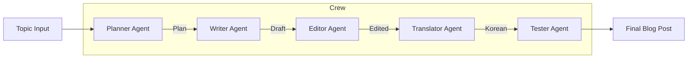

# Chapter 20 Summary (CrewAI Multi-Agent)

## Keywords
- **CrewAI**: 역할 기반 멀티 에이전트 오케스트레이션.
- **Role-Playing**: 전문가 역할(Role) 부여.
- **Collaboration**: 에이전트 간 협업 프로세스.

## Concept
혼자서 모든 것을 다 잘하는 '슈퍼맨'보다, 각 분야의 '전문가 팀'이 더 효율적일 때가 있습니다. CrewAI는 기획자, 작가, 편집자처럼 **명확한 역할(Role)과 목표(Goal)** 를 가진 에이전트들을 구성하고, 이들이 순차적으로 또는 계층적으로 협업하여 복잡한 과업을 완수하게 합니다.

## Analysis
### Pros & Cons
- **Pros**:
    - **Expertise**: 각 에이전트가 특정 역할에 집중하므로 결과물의 품질이 높음 (예: 작가는 글쓰기만, 편집자는 교정만).
    - **Structure**: 사람의 업무 프로세스(조직도)를 그대로 모방하여 설계하기 쉬움.
- **Cons**:
    - **Overhead**: 에이전트 간 통신 및 조율 비용 발생.
    - **Latency**: 여러 에이전트가 순차적으로 작업하므로 전체 실행 시간이 김.

### Application Points
- **Content Marketing Team**: [주제 발굴 -> 초안 작성 -> SEO 최적화 -> 교정 -> 번역].
- **Software Dev Team**: [기획 -> 설계 -> 코드 작성 -> 코드 리뷰 -> 테스팅].
- **Research Team**: [자료 수집 -> 데이터 분석 -> 보고서 작성].

## Structure

## Flow (Simplified)
1.  **Define Agents**: 기획자, 작가, 편집자, 번역가, 검수자 정의.
2.  **Define Tasks**: 각 에이전트가 수행할 구체적인 과업(Task) 정의.
3.  **Create Crew**: 에이전트와 태스크를 묶어 팀(Crew) 결성.
4.  **Kickoff**: 주제를 던져주고 협업 시작.