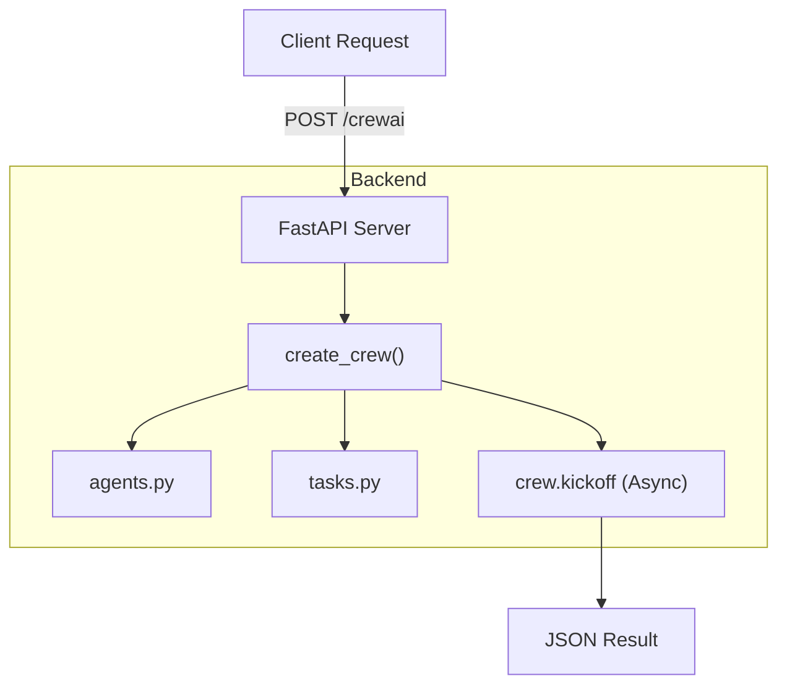

# Chapter 21 Summary (CrewAI Serving)

## Keywords
- **Production Ready**: 실서비스 배포 준비.
- **Modular Design**: 모듈화된 코드 구조.
- **API Wrapper**: CrewAI의 API화.

## Concept
CrewAI로 만든 멀티 에이전트 시스템을 로컬 스크립트(`python main.py`)로만 실행하는 것은 한계가 있습니다. 이를 웹 서비스나 모바일 앱에서 사용할 수 있도록 **FastAPI**로 감싸서 **API 서버**로 만드는 과정입니다. 또한, 코드를 역할별(`agents.py`, `tasks.py`)로 분리하여 유지보수성을 높입니다.

## Analysis
### Pros & Cons
- **Pros**:
    - **Scalability**: API 서버로 배포하면 여러 사용자의 요청을 처리할 수 있음.
    - **Maintainability**: 코드가 모듈화되어 있어 에이전트나 태스크 수정이 용이함.
    - **Integration**: 프론트엔드나 다른 백엔드 서비스와 쉽게 연동 가능.
- **Cons**:
    - **Async**: CrewAI의 긴 실행 시간을 처리하기 위해 비동기(Async) 처리에 신경 써야 함.
    - **State**: 서버 재시작 시 실행 중인 에이전트 상태가 유실될 수 있음 (DB 연동 필요).

### Application Points
- **SaaS Platform**: "AI 블로그 자동 작성 서비스"와 같은 웹 서비스 백엔드.
- **Slack/Discord Bot**: 채팅방에서 명령을 내리면 팀이 움직여 결과를 가져오는 봇.
- **Workflow Automation**: 사내 업무 자동화 시스템의 엔진.

## Structure

## Flow (Simplified)
1.  **Refactor**: 단일 파일 코드를 `agents.py`, `tasks.py`, `crew.py`로 분리.
2.  **API Endpoint**: FastAPI로 `/crewai` POST 요청 핸들러 작성.
3.  **Execution**: 요청 수신 시 Crew 생성 및 비동기 실행.
4.  **Response**: 실행 결과를 JSON으로 변환하여 클라이언트에게 반환.